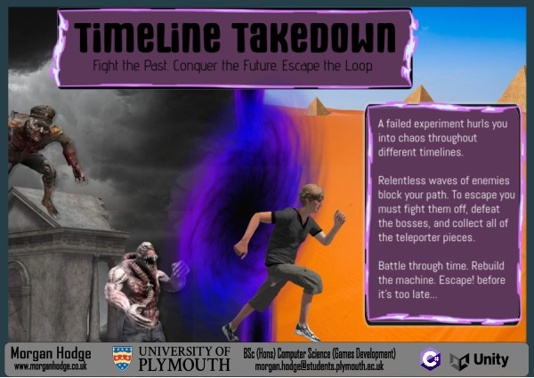

  

Timeline Takedown is a first-person, round-based survival game developed as my final year dissertation project at the University of Plymouth.

  

# 🗂️ What's in this repository?
- A comprehensive Game Design Document (GDD)

- A 10,000-word report detailing the development process

- Paper-based design assets (level layouts, UI concepts, character sketches)

- Poster drafts and the final promotional poster

# 🕹️ How to Play
Head over to https://morganhodge.itch.io/timeline-takedown

1.  Scroll down the page to the Download button
2.  Download
3.  Unzip File called "TimelineTakedownEXE.zip"
4.  Launch Timeline Takedown.exe
5.  Enjoy

# 🎮 About the Game
In Timeline Takedown, you must survive intense waves of enemies and defeat the boss at the end of each round to progress to the next level.
The game was developed in Unity over a 6-month period.

# 📷 Video Discusing the Final Project
- [Here](https://youtu.be/qxRej_0ZuJ0)

  
# 📷 Devlogs
Check out the development journey, challenges, and progress updates:
- [Devlog 1](https://youtu.be/Su4Demj-MFw)
- [Devlog 2](https://youtu.be/RXlF7QE14os)
- [Devlog_3](https://youtu.be/vxEHmGPZ-y4)
- [Devlog_4](https://youtu.be/lJwd-J0-sTs)
- [Devlog_5](https://youtu.be/2hVWVUD5KXo)
- [Devlog 6](https://youtu.be/nWcjUrmOtSQ)
- [Devlog 7](https://youtu.be/-r5FLIDuMCo)

# 🛠️Tools Used
- [Map Creation](https://app.dungeonscrawl.com/)
- [Tracking Tool](https://trello.com/b/Y88bQSkB/timeline-takedown)
- [Online Assets](https://assetstore.unity.com/)
- [Modeling tool](https://realtimecsg.com/)

### Timeline Takedown was created By Morgan Hodge

#### Project Supervisor : Ji-Jian Chin

